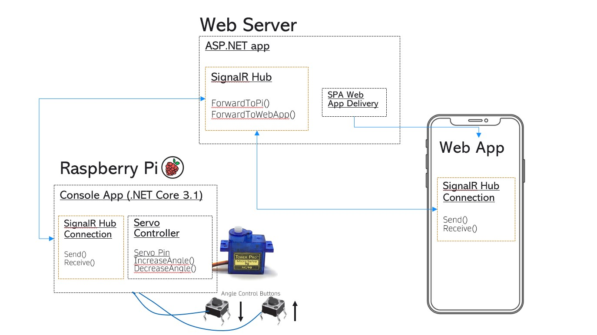

# Real-Time IoT with .NET and Raspberry Pi
This repo contains a Visual Studio solution that demonstrates the possibilities of .NET Dev on the Raspberry Pi.

## Solution overview:

# Raspberry Pi Dev Resources:

## .NET Dev Resources

### Installing ASP.Net on raspi
[https://docs.microsoft.com/en-us/dotnet/iot/deployment](https://docs.microsoft.com/en-us/dotnet/iot/deployment)  
  
##### add dotnet to the secure path  
commands:  
sudo visudo  
and add :/home/pi/.dotnet to the secure_path  
Defaults secure_path="/usr/local/sbin:/usr/local/bin:/usr/sbin:/usr/bin:/sbin:/bin:/home/pi$  
  
### Debugging:  
[https://docs.microsoft.com/en-us/dotnet/iot/debugging?pivots=vscode](https://docs.microsoft.com/en-us/dotnet/iot/debugging?pivots=vscode)  
  
### root debugging:  
[https://raspberrypi.stackexchange.com/questions/112710/how-to-attach-visual-studio-to-a-process-with-ssh-that-has-been-started-as-root](https://raspberrypi.stackexchange.com/questions/112710/how-to-attach-visual-studio-to-a-process-with-ssh-that-has-been-started-as-root)  
  
### ssh deploy of apps:  
[https://unosquare.github.io/raspberryio/](https://unosquare.github.io/raspberryio/)  

### Hosting ASP.NET IIS (running on Windows 10) on LAN:  
[https://marketplace.visualstudio.com/items?itemName=vs-publisher-1448185.ConveyorbyKeyoti](https://marketplace.visualstudio.com/items?itemName=vs-publisher-1448185.ConveyorbyKeyoti)  
 
### SignalR with Vue:  
[https://www.dotnetcurry.com/aspnet-core/1480/aspnet-core-vuejs-signalr-app](https://www.dotnetcurry.com/aspnet-core/1480/aspnet-core-vuejs-signalr-app)  
  
### How to expose an ASP.NET IIS server running on the Pi to the LAN  ( reverse proxy with nginx ) :  
[https://edi.wang/post/2019/9/29/setup-net-core-30-runtime-and-sdk-on-raspberry-pi-4](https://edi.wang/post/2019/9/29/setup-net-core-30-runtime-and-sdk-on-raspberry-pi-4) 

## Working with GPIO (Several Libraries Available for this)

I encountered several ways to control servos with with DotNet and the Raspberry Pi. The simplest one I learned of after I finished the solution that is in this repo. It is to use the library [Iot.Device.Bindings](https://www.nuget.org/packages/Iot.Device.Bindings/) in conjuction with System.Device.PWM . There is an Iot.Device.ServoMotor that has a constructor that allows you to bind to a GPIO pin and specify the range of the servo and the max and min PWM values for it. In this solution however, I used the low level approach of the Unosquare.RaspberryIO.Pi library, as well as tried using System.Device.Gpio .

### The Good base library for GPIO and all things IoT!
Check out https://github.com/dotnet/iot => I wish I had found this before I spent time creating my own servo motor controller

### GPIO library from microsoft (System.Device.Gpio)
[https://docs.microsoft.com/en-us/dotnet/iot/tutorials/temp-sensor](https://docs.microsoft.com/en-us/dotnet/iot/tutorials/temp-sensor)

### reading push buttons buttons (System.Device.Gpio) 
[https://docs.microsoft.com/en-us/samples/microsoft/windows-iotcore-samples/push-button/](https://docs.microsoft.com/en-us/samples/microsoft/windows-iotcore-samples/push-button/)  

### GPIO library from Unosquare (Unosquare.RaspberryIO.Pi)
[https://github.com/unosquare/raspberryio](https://github.com/unosquare/raspberryio)

### reading push buttons buttons (Unosquare.RaspberryIO.Pi) 
[https://github.com/unosquare/raspberryio#interrupts-and-callbacks](https://github.com/unosquare/raspberryio#interrupts-and-callbacks)  
  
### learn servos:  
[https://learn.adafruit.com/adafruits-raspberry-pi-lesson-8-using-a-servo-motor/software](https://learn.adafruit.com/adafruits-raspberry-pi-lesson-8-using-a-servo-motor/software)  
  
#### PWM output on the Pi:  
[https://raspberrypi.stackexchange.com/questions/53854/driving-pwm-output-frequency](https://raspberrypi.stackexchange.com/questions/53854/driving-pwm-output-frequency)  
  
[https://www.jameco.com/Jameco/workshop/Howitworks/how-servo-motors-work.html](https://www.jameco.com/Jameco/workshop/Howitworks/how-servo-motors-work.html)  
  
### Raspi 3 board pinout:  
[https://pinout.xyz/pinout/pin35_gpio19](https://pinout.xyz/pinout/pin35_gpio19)  

### install wiring pi and export GPIO pin so that it can be used by an app without "sudo" (Uno Sqaure Method):  
[http://wiringpi.com/the-gpio-utility/](http://wiringpi.com/the-gpio-utility/)  
 
## Raspi Pro Tips:  
  
### Boot from USB for faster read and write speeds (Uses same bus as ethernet so not the best for Network intensive applications):  
[https://www.raspberrypi.org/forums/viewtopic.php?t=108400](https://www.raspberrypi.org/forums/viewtopic.php?t=108400)  
    

### Backup your Pi Card images and compress to reasonable size!
e.g. A 32GB sd => 32GB .img => PiShrink() => 2gb .img=>.zip=>800Mb zipped .img!
https://github.com/Drewsif/PiShrink
